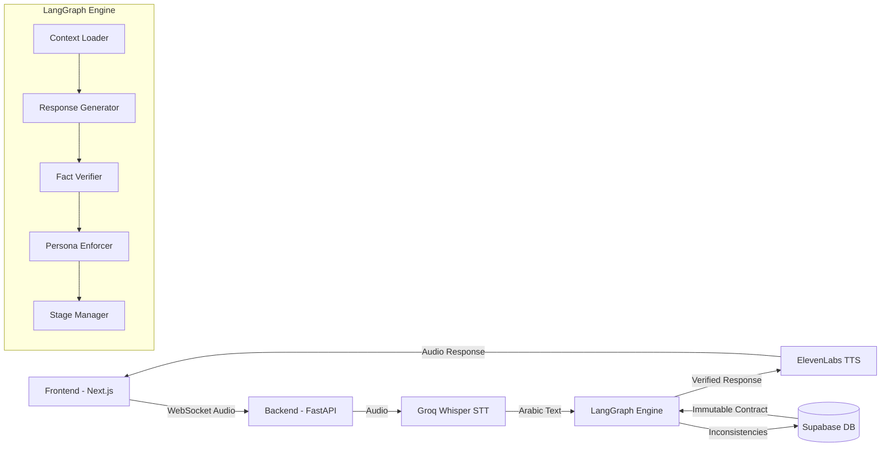

<div align="center">

# 🎙️ Sarah AI - Intelligent Recruitment for Golden Crust Bakery

**Zero-Hallucination Agentic Voice AI for Credibility-Focused Interviews in Jordanian Arabic**

[](https://fastapi.tiangolo.com/)
[](https://nextjs.org/)
[](https://github.com/langchain-ai/langgraph)
[](https://groq.com/)
[](https://supabase.io/)

</div>

## 📋 Project Overview

Sarah AI is a sophisticated agentic voice assistant that conducts zero-hallucination interviews in Jordanian Arabic for Golden Crust Bakery. Built on a custom LangGraph architecture, the system enforces immutable fact contracts to prevent hallucinations and ensures strict adherence to Jordanian dialect. The system enhances the recruitment process by comparing candidates' registration form data with their live interview responses, detecting inconsistencies in real-time, and providing credibility scoring to help HR teams make better hiring decisions.

## ✨ Key Features

- 🔒 **Immutable Fact Contracts:** Zero-hallucination guarantee through cryptographic verification
- 🎙️ **Groq STT Integration:** 99% accurate Arabic transcription using Whisper-large-v3-turbo
- 🧠 **LangGraph State Machine:** Multi-stage interview flow with fact verification at every step
- ⚖️ **Triple-Verification System:** Fact checking, persona enforcement, and language validation
- 🇯🇴 **Strict Jordanian Dialect:** Enforced Ammiya dialect with MSA→Jordanian conversion
- 📊 **HR Dashboard:** Real-time visual progress and credibility alerts during interviews

## 🏗️ Architecture



## 🧱 Project Structure

```
├── frontend/          # Next.js 14 (App Router) + Tailwind CSS
├── backend/           # FastAPI (Python)
│   ├── app/
│   │   ├── api/       # API routes
│   │   │   └── websocket/  # WebSocket handlers
│   │   ├── core/      # LangGraph agentic components
│   │   │   ├── fact_contract.py  # Immutable contracts
│   │   │   ├── persona_enforcer.py  # Dialect enforcement
│   │   │   └── interview_agent.py  # LangGraph state machine
│   │   ├── models/    # Pydantic models
│   │   ├── services/  # Business logic
│   │   └── db/        # Database connections
├── docker-compose.yml # Orchestrates both services
├── .env.example       # Environment template (copy to .env)
└── ARCHITECTURE.md    # Full technical specification
```

## 🚀 Quick Start

### 1. Environment Setup

Copy the environment template and fill in your values:

```bash
cp .env.example .env
```

Edit `.env` with your Supabase, Groq, and ElevenLabs API keys.

### 2. Run with Docker Compose

```bash
docker-compose up --build
```

- **Frontend**: http://localhost:3000
- **Backend API**: http://localhost:8000
- **API Docs**: http://localhost:8000/docs

### 3. Run Locally (Development)

**Backend:**
```bash
cd backend
pip install -r requirements.txt
uvicorn app.main:app --reload
```

**Frontend:**
```bash
cd frontend
npm install
npm run dev
```

## 🧪 Testing the System

1. Register a candidate through the `/apply` form
2. Access the interview page at `/interview/[candidateId]`
3. Conduct a voice interview with Sarah AI
4. Observe real-time inconsistency detection
5. Review the final credibility assessment in the HR dashboard

## 📝 License

This project is proprietary and confidential. © 2026 Golden Crust Bakery.

## 🙏 Acknowledgements

- [Groq](https://groq.com/) for high-performance LLM and STT
- [ElevenLabs](https://elevenlabs.io/) for natural Arabic TTS
- [Supabase](https://supabase.io/) for database and authentication
- [FastAPI](https://fastapi.tiangolo.com/) and [Next.js](https://nextjs.org/) for the application framework

## 🛠️ Tech Stack

| Component | Technology | Description |
|-----------|------------|-------------|
| **Frontend** | Next.js 14 | React framework with App Router and Tailwind CSS |
| **Backend** | FastAPI | High-performance Python API framework |
| **Database** | Supabase | PostgreSQL database with real-time capabilities |
| **Speech-to-Text** | Groq Whisper | High-accuracy Arabic transcription |
| **Agent Framework** | LangGraph 0.2.16 | State machine for multi-stage verification |
| **LLM** | Groq Llama-3 | Zero-hallucination interview agent |
| **Text-to-Speech** | ElevenLabs | Natural Arabic voice synthesis |
| **Communication** | WebSockets | Full-duplex real-time audio streaming |
| **Validation** | Guardrails AI | Additional safety layer for LLM outputs |
| **Deployment** | Docker | Containerized deployment with Docker Compose |

## 🔑 Environment Variables

| Variable | Description |
|----------|-------------|
| `SUPABASE_URL` | Supabase project URL |
| `SUPABASE_KEY` | Supabase service role key |
| `GROQ_API_KEY` | Groq API key for STT and LLM |
| `OPENAI_API_KEY` | OpenAI API key for LangGraph engine |
| `ELEVENLABS_API_KEY` | ElevenLabs API key (backend) |
| `NEXT_PUBLIC_ELEVENLABS_API_KEY` | ElevenLabs API key (frontend) |
| `NEXT_PUBLIC_SUPABASE_*` | Supabase client credentials |
| `LANGGRAPH_TRACING_V2` | Enable LangGraph tracing (optional) |

## 🚀 Key Routes

**Frontend:**
- `/apply` - Candidate registration form with detailed fields
- `/interview/[candidateId]` - Context-aware voice AI interview with Sarah
- `/dashboard` - HR dashboard with candidate overview
- `/dashboard/candidates/[id]` - Detailed candidate profile with credibility assessment
- `/dashboard/analytics` - Interview analytics and insights

**Backend API:**
- `POST /api/transcribe` - Groq Whisper transcription endpoint
- `POST /api/interview/start` - Initialize interview session with fact contract
- `WebSocket /ws/interview/{candidate_id}` - Real-time interview with LangGraph agent
- `POST /api/interview/summary` - Generate interview summary with credibility assessment

## 📊 Credibility Scoring

Sarah AI features a sophisticated credibility scoring system that:

1. Creates immutable fact contracts from candidate registration data
2. Verifies every LLM response against the fact contract before delivery
3. Detects inconsistencies in real-time during the interview
4. Auto-corrects hallucinated facts before they reach the candidate
5. Flags potential misrepresentations with severity ratings
6. Provides HR staff with a comprehensive credibility assessment
7. Stores inconsistencies for future reference and pattern analysis
