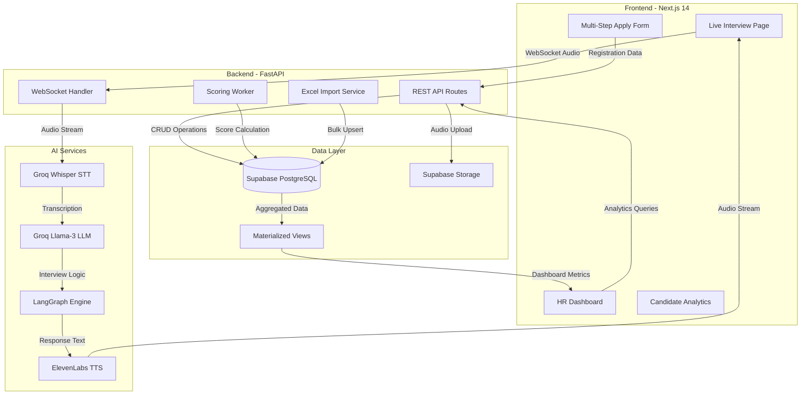

<div align="center">

# 🎙️ Sarah AI — Intelligent HR Recruiter

**Next-Generation Agentic Voice AI for End-to-End Recruitment at Qabalan Bakery**

[](https://nextjs.org/)
[](https://fastapi.tiangolo.com/)
[](https://groq.com/)
[](https://elevenlabs.io/)
[](https://supabase.io/)
[](LICENSE)

*Transforming HR recruitment with conversational AI, real-time analytics, and immersive candidate experiences*

</div>

---

## 📋 Overview

**Sarah AI** is a production-ready, end-to-end recruitment platform that conducts intelligent voice interviews in **Jordanian Arabic (عامية أردنية)**. Built for Qabalan Bakery (مخبز قبلان), the system combines cutting-edge AI with enterprise-grade infrastructure to deliver:

- 🎯 **Zero-hallucination interviews** through LangGraph state machines
- 🎙️ **Natural Arabic conversations** via ElevenLabs TTS
- 📊 **Advanced HR analytics** with dynamic scoring algorithms
- ⚡ **Modern UX** with multi-step forms and real-time visualizers
- 🔒 **Enterprise security** with Supabase Auth and RLS policies

---

## ✨ Key Features

### 🎙️ **Live AI Voice Interview**
- Real-time full-duplex audio streaming via WebSockets
- Groq Whisper for high-accuracy Arabic transcription (whisper-large-v3-turbo)
- Groq Llama-3 for intelligent conversation flow with OpenAI fallback
- ElevenLabs TTS with natural Jordanian Arabic voice
- Web Audio API visualizer with 32-bar frequency display
- Turn-locked processing to prevent audio overlap

### 📊 **Advanced HR Dashboard**
- **Candidate Analytics**: Score distribution, recommendation breakdown, interview metrics
- **Excel Bulk Import**: Drag-and-drop CSV/XLSX import with intelligent column mapping
- **Signed Audio URLs**: Secure 1-hour signed URLs for private interview recordings
- **Dynamic Scoring**: Real-time credibility assessment with registration weight system
- **3-Tab Settings**: Manage questions, registration weights, and AI configuration

### ⚡ **Multi-Step Candidate Experience**
- **4-Step Apply Form**: Personal info → Job details → Education → Commitments
- **Framer Motion Animations**: Smooth slide transitions with progress indicators
- **Dark Immersive Theme**: Qabalan brand styling with slate/amber/gold palette
- **RTL-Optimized**: Full Arabic language support with right-to-left layout

### 🧮 **Intelligent Scoring System**
- **6-Category Assessment**: Communication, Learning, Stability, Credibility, Adaptability, Knowledge
- **Registration Weights**: Configurable scoring weights per role (cashier/supervisor)
- **Inconsistency Detection**: Automatic flagging of form vs. interview contradictions
- **Background Processing**: Non-blocking scoring worker with async job queue

### 🔐 **Enterprise Security**
- Supabase Row-Level Security (RLS) policies
- API key authentication for admin endpoints
- JWT-based candidate authentication
- Signed URLs for private storage access
- Environment-based configuration

---

## 🏗️ Architecture


```mermaid
flowchart TB
    subgraph "Frontend - Next.js 14"
        A1[Multi-Step Apply Form]
        A2[Live Interview Page]
        A3[HR Dashboard]
        A4[Candidate Analytics]
    end
    
    subgraph "Backend - FastAPI"
        B1[REST API Routes]
        B2[WebSocket Handler]
        B3[Scoring Worker]
        B4[Excel Import Service]
    end
    
    subgraph "AI Services"
        C1[Groq Whisper STT]
        C2[Groq Llama-3 LLM]
        C3[ElevenLabs TTS]
        C4[LangGraph Engine]
    end
    
    subgraph "Data Layer"
        D1[(Supabase PostgreSQL)]
        D2[Supabase Storage]
        D3[Materialized Views]
    end
    
    A1 -->|Registration Data| B1
    A2 -->|WebSocket Audio| B2
    A3 -->|Analytics Queries| B1
    
    B2 -->|Audio Stream| C1
    C1 -->|Transcription| C2
    C2 -->|Interview Logic| C4
    C4 -->|Response Text| C3
    C3 -->|Audio Stream| A2
    
    B1 -->|CRUD Operations| D1
    B3 -->|Score Calculation| D1
    B4 -->|Bulk Upsert| D1
    B1 -->|Audio Upload| D2
    
    D1 -->|Aggregated Data| D3
    D3 -->|Dashboard Metrics| A3
```

### **Data Flow**

1. **Candidate Registration**: Multi-step form → FastAPI → Supabase candidates table
2. **Interview Session**: WebSocket audio → Groq Whisper STT → Groq Llama-3 → LangGraph → ElevenLabs TTS → Browser
3. **Scoring**: Background worker → Credibility analysis → Scores table → Dashboard
4. **HR Review**: Dashboard queries → Materialized views → Real-time analytics

---

## 🎨 Screenshots

### Multi-Step Apply Form
*4-step wizard with Framer Motion animations and progress indicators*


### Live Interview Room
*Immersive dark theme with Web Audio visualizer and real-time transcript*


### HR Dashboard
*Advanced analytics with score distribution and candidate filtering*


### Settings Management
*3-tab interface for questions, weights, and AI configuration*


---

## 🚀 Installation

### **Prerequisites**

- Node.js 18+ and npm
- Python 3.11+
- Supabase account
- API keys: Gemini, ElevenLabs

### **1. Clone Repository**

```bash
git clone https://github.com/yourusername/sarah-ai-hr-interviewer.git
cd sarah-ai-hr-interviewer
```

### **2. Backend Setup**

```bash
cd backend

# Create virtual environment
python -m venv venv
venv\Scripts\activate  # Windows
# source venv/bin/activate  # macOS/Linux

# Install dependencies
pip install -r requirements.txt

# Configure environment
copy .env.example .env
# Edit .env with your API keys
```

**Backend `.env` Configuration:**

```env
# Supabase
SUPABASE_URL=https://your-project.supabase.co
SUPABASE_KEY=your-anon-key
SUPABASE_SERVICE_ROLE_KEY=your-service-role-key

# AI Services
GROQ_API_KEY=your-groq-api-key
OPENAI_API_KEY=your-openai-api-key  # Fallback LLM
ELEVENLABS_API_KEY=your-elevenlabs-api-key

# Admin
ADMIN_API_KEY=your-secure-admin-key
```

**Run Database Migrations:**

```bash
# Execute in Supabase SQL Editor
backend/migrations/create_settings_tables.sql
backend/migrations/add_review_status.sql
backend/migrations/fix_dashboard_refresh.sql
```

**Start Backend Server:**

```bash
uvicorn app.main:app --port 8001 --reload
```

**Start Scoring Worker:**

```bash
python start_worker.py
```

### **3. Frontend Setup**

```bash
cd frontend

# Install dependencies
npm install

# Configure environment
copy .env.example .env.local
# Edit .env.local with your keys
```

**Frontend `.env.local` Configuration:**

```env
NEXT_PUBLIC_API_URL=http://localhost:8001
NEXT_PUBLIC_ADMIN_API_KEY=your-secure-admin-key

NEXT_PUBLIC_SUPABASE_URL=https://your-project.supabase.co
NEXT_PUBLIC_SUPABASE_ANON_KEY=your-anon-key

NEXT_PUBLIC_ELEVENLABS_API_KEY=your-elevenlabs-api-key
```

**Start Development Server:**

```bash
npm run dev
```

### **4. Access Application**

- **Candidate Portal**: http://localhost:3000/apply
- **Interview Page**: http://localhost:3000/interview/[candidateId]
- **HR Dashboard**: http://localhost:3000/dashboard
- **API Documentation**: http://localhost:8001/docs

---

## 📁 Project Structure

```
sarah-ai-hr-interviewer/
├── frontend/                      # Next.js 14 Application
│   ├── app/
│   │   ├── (candidate)/          # Candidate-facing routes
│   │   │   ├── apply/            # Multi-step registration form
│   │   │   └── interview/        # Live AI interview page
│   │   └── (hr)/                 # HR dashboard routes
│   │       └── dashboard/
│   │           ├── page.tsx      # Analytics overview
│   │           ├── candidates/   # Candidate list + detail
│   │           ├── analytics/    # Advanced metrics
│   │           └── settings/     # 3-tab settings UI
│   ├── components/               # Reusable React components
│   ├── hooks/
│   │   ├── useVoiceInterview.ts  # WebSocket + audio pipeline
│   │   └── useAudioRecorder.ts   # Full-session recording
│   ├── lib/
│   │   └── supabase/             # Supabase client
│   └── package.json
│
├── backend/                       # FastAPI Application
│   ├── app/
│   │   ├── api/
│   │   │   ├── routes/
│   │   │   │   ├── admin.py      # HR dashboard endpoints
│   │   │   │   ├── candidates.py # Candidate CRUD
│   │   │   │   └── interview.py  # Interview session management
│   │   │   └── websocket/
│   │   │       └── interview_handler.py  # Real-time audio
│   │   ├── core/
│   │   │   ├── interview_agent.py        # LangGraph state machine
│   │   │   ├── fact_contract.py          # Zero-hallucination contracts
│   │   │   └── persona_enforcer.py       # Jordanian dialect
│   │   ├── services/
│   │   │   ├── groq_transcriber.py       # Groq Whisper STT
│   │   │   ├── elevenlabs_tts.py         # Text-to-speech
│   │   │   └── credibility_scorer.py     # Scoring algorithm
│   │   ├── workers/
│   │   │   └── scoring_worker.py         # Background job processor
│   │   └── db/
│   │       └── supabase_client.py        # Database singleton
│   ├── migrations/               # SQL migration scripts
│   ├── requirements.txt
│   └── start_worker.py
│
├── docs/                         # Documentation
│   ├── screenshots/
│   └── architecture/
│
├── .gitignore
├── README.md
└── LICENSE
```

---

## 🛠️ Tech Stack

### **Frontend**

| Technology | Purpose | Version |
|------------|---------|---------|
| **Next.js** | React framework with App Router | 14.2.x |
| **Tailwind CSS** | Utility-first CSS framework | 3.4.x |
| **Framer Motion** | Animation library for smooth transitions | 11.0.x |
| **Lucide React** | Modern icon library | Latest |
| **Recharts** | Data visualization for analytics | 3.8.x |
| **Sonner** | Toast notifications | 2.0.x |
| **React Hook Form** | Form state management | Latest |
| **Zod** | Schema validation | Latest |

### **Backend**

| Technology | Purpose | Version |
|------------|---------|---------|
| **FastAPI** | High-performance Python API framework | Latest |
| **Supabase** | PostgreSQL database + Auth + Storage | Latest |
| **Pandas** | Data manipulation for Excel import | Latest |
| **openpyxl** | Excel file parsing | Latest |
| **python-multipart** | File upload support | Latest |
| **httpx** | Async HTTP client | Latest |

### **AI & Voice**

| Technology | Purpose | Details |
|------------|---------|---------|
| **Groq Whisper** | Speech-to-text transcription | whisper-large-v3-turbo with Arabic hints |
| **Groq Llama-3** | Interview conversation logic | llama-3.1-70b-versatile with OpenAI fallback |
| **ElevenLabs** | Natural Arabic TTS | Jordanian voice model |
| **LangGraph** | Agentic state machine | 8-node pipeline |
| **Web Audio API** | Real-time audio visualization | Browser native |

---

## 🔑 API Endpoints

### **Candidate Routes**

| Method | Endpoint | Description |
|--------|----------|-------------|
| `POST` | `/api/candidates` | Create new candidate |
| `GET` | `/api/candidates/{id}` | Get candidate details |
| `GET` | `/api/candidates/{id}/registration-context` | Get registration form data |

### **Interview Routes**

| Method | Endpoint | Description |
|--------|----------|-------------|
| `POST` | `/api/interview/start` | Initialize interview session |
| `WS` | `/ws/interview/{candidate_id}` | WebSocket audio stream |
| `PATCH` | `/api/interview/{id}/link` | Link external call ID |

### **Admin Routes**

| Method | Endpoint | Description |
|--------|----------|-------------|
| `GET` | `/api/admin/dashboard` | Dashboard analytics |
| `GET` | `/api/admin/candidates` | List candidates with filters |
| `GET` | `/api/admin/candidates/{id}/detail` | Detailed candidate profile |
| `GET` | `/api/admin/candidates/{id}/audio-url` | Get signed audio URL |
| `POST` | `/api/admin/import/candidates` | Bulk import from Excel/CSV |
| `PATCH` | `/api/admin/candidates/{id}/review-status` | Update review status |
| `GET` | `/api/admin/registration-weights` | List registration weights |
| `PATCH` | `/api/admin/registration-weights/{id}` | Update weight value |
| `GET` | `/api/admin/ai-settings` | List AI configuration |
| `PATCH` | `/api/admin/ai-settings/{key}` | Update AI setting |

---

## 📊 Database Schema

### **Core Tables**

- **`candidates`**: Candidate personal and registration data
- **`interviews`**: Interview session records with status tracking
- **`scores`**: AI-generated scores and recommendations
- **`scoring_jobs`**: Background job queue for score calculation
- **`question_bank`**: Dynamic interview questions (6 categories)
- **`registration_weights`**: Configurable scoring weights per role
- **`ai_settings`**: AI configuration (max retries, scoring weights)
- **`admin_users`**: HR dashboard authentication

### **Materialized Views**

- **`mv_admin_dashboard`**: Aggregated candidate data for fast dashboard queries

---

## 🎯 Future Roadmap

### **Phase 4: Communication & Notifications**
- 📱 SMS notifications via Twilio
- 📧 Email templates for interview invites
- 🔔 Real-time dashboard notifications

### **Phase 5: Advanced AI Features**
- 🎥 Video interview analysis
- 😊 Sentiment analysis during interviews
- 🧠 Multi-language support (English, MSA)

### **Phase 6: Enterprise Features**
- 👥 Multi-tenant support
- 📈 Advanced reporting and exports
- 🔗 ATS integration (Greenhouse, Lever)
- 📊 Custom scoring algorithms per company

### **Phase 7: Mobile Experience**
- 📱 React Native mobile app
- 🎙️ Native audio recording
- 📲 Push notifications

---

## 🧪 Testing

### **Run Backend Tests**

```bash
cd backend
pytest tests/ -v
```

### **Run Frontend Tests**

```bash
cd frontend
npm test
```

### **Manual Testing Workflow**

1. **Register Candidate**: Navigate to `/apply` and complete 4-step form
2. **Start Interview**: Access `/interview/[candidateId]` and click "بدء المقابلة"
3. **Conduct Interview**: Speak naturally in Arabic, watch real-time visualizer
4. **Review Dashboard**: Check `/dashboard` for analytics and candidate scores
5. **Test Excel Import**: Upload CSV/XLSX file in candidates list page
6. **Manage Settings**: Configure weights and AI settings in `/dashboard/settings`

---

## 🐛 Troubleshooting

### **Common Issues**

**Issue**: WebSocket connection fails
- **Solution**: Ensure backend is running on port 8001 and CORS is configured

**Issue**: Audio not playing in interview
- **Solution**: Check browser microphone permissions and ElevenLabs API key

**Issue**: Excel import fails
- **Solution**: Verify column names match expected format (الاسم الكامل, رقم الهاتف)

**Issue**: Dashboard shows no data
- **Solution**: Run materialized view refresh: `REFRESH MATERIALIZED VIEW CONCURRENTLY mv_admin_dashboard;`

---

## 📝 License

This project is **proprietary and confidential**.  
© 2026 Qabalan Bakery (مخبز قبلان). All rights reserved.

Unauthorized copying, distribution, or use of this software is strictly prohibited.

---

## 🙏 Acknowledgements

Built with cutting-edge technologies:

- [**Groq**](https://groq.com/) — Lightning-fast LLM inference and Whisper STT
- [**ElevenLabs**](https://elevenlabs.io/) — Natural Arabic text-to-speech
- [**Supabase**](https://supabase.io/) — Open-source Firebase alternative
- [**FastAPI**](https://fastapi.tiangolo.com/) — Modern Python web framework
- [**Next.js**](https://nextjs.org/) — React framework for production
- [**LangGraph**](https://github.com/langchain-ai/langgraph) — Agentic workflow framework
- [**Framer Motion**](https://www.framer.com/motion/) — Production-ready animation library

---

<div align="center">

**Made with ❤️ for the future of HR recruitment**

[Report Bug](https://github.com/yourusername/sarah-ai/issues) · [Request Feature](https://github.com/yourusername/sarah-ai/issues) · [Documentation](https://github.com/yourusername/sarah-ai/wiki)

</div>
