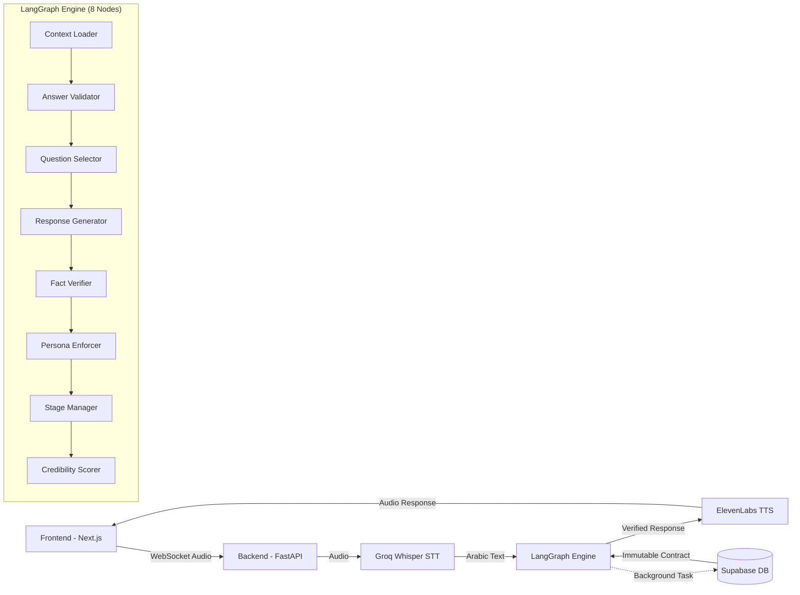

<div align="center">

# 🎙️ Sarah AI - Intelligent Recruitment for Golden Crust Bakery

**Zero-Hallucination Agentic Voice AI for Credibility-Focused Interviews in Jordanian Arabic**

[](https://fastapi.tiangolo.com/)
[](https://nextjs.org/)
[](https://github.com/langchain-ai/langgraph)
[](https://groq.com/)
[](https://supabase.io/)

</div>

## 📋 Project Overview

Sarah AI is a sophisticated agentic voice assistant that conducts zero-hallucination interviews in Jordanian Arabic for Golden Crust Bakery (مخبز قبلان). Built on a custom **LangGraph state machine**, the system enforces immutable fact contracts to prevent hallucinations and ensures strict adherence to Jordanian dialect (عامية أردنية).

The system conducts a structured **6-category interview** covering: Communication, Learning Ability, Stability, Credibility, Adaptability, and Job Knowledge — then scores candidates using a real-time credibility engine that compares registration form data against live interview responses.

## ✨ Key Features

- 🔒 **Immutable Fact Contracts** — Zero-hallucination guarantee through contract-locked responses
- 🎙️ **Groq Whisper STT** — 99% accurate Arabic transcription (Whisper-large-v3-turbo)
- 🧠 **8-Node LangGraph Pipeline** — load_context → validate_answer → select_question → generate_response → verify_facts → enforce_persona → check_stage_transition → score_credibility
- 🔒 **Turn-Lock Mutex** — Prevents simultaneous question processing; discards audio while Sarah is thinking
- 💾 **Memory-First Architecture** — All DB writes are non-blocking background tasks; interview never hangs on Supabase
- 🔇 **Aggressive VAD** — Two-layer noise filter (audio size + transcript quality) kills keyboard clicks and Whisper hallucinations
- ⚖️ **Triple-Verification** — Fact checking, persona enforcement, and language validation on every turn
- 🇯🇴 **Strict Jordanian Dialect** — Enforced Ammiya with MSA→Jordanian conversion
- 📊 **6-Category Question Bank** — Database-driven questions across 6 mandatory categories
- 🧮 **Real-Time Credibility Scoring** — Per-turn scoring with final assessment and recommendation

## 🏗️ Architecture


```mermaid
flowchart LR
    A[Frontend - Next.js] -->|WebSocket Audio| B[Backend - FastAPI]
    B -->|Audio| C[Groq Whisper STT]
    C -->|Arabic Text| D[LangGraph Engine]
    D -->|Verified Response| E[ElevenLabs TTS]
    F[(Supabase DB)] -->|Immutable Contract| D
    D -.->|Background Task| F
    E -->|Audio Response| A
    
    subgraph "LangGraph Engine (8 Nodes)"
      L1[Context Loader] --> L1b[Answer Validator]
      L1b --> L2[Question Selector]
      L2 --> L3[Response Generator]
      L3 --> L4[Fact Verifier]
      L4 --> L5[Persona Enforcer]
      L5 --> L6[Stage Manager]
      L6 --> L7[Credibility Scorer]
    end
```

## 🧱 Project Structure

```
├── frontend/              # Next.js 14 (App Router) + Tailwind CSS
├── backend/               # FastAPI (Python)
│   ├── app/
│   │   ├── api/
│   │   │   ├── routes/        # REST endpoints (candidates, interview)
│   │   │   └── websocket/     # WebSocket handler (bulletproof turn-lock)
│   │   ├── core/
│   │   │   ├── interview_agent.py   # LangGraph 8-node state machine
│   │   │   ├── fact_contract.py     # Immutable fact contracts
│   │   │   ├── persona_enforcer.py  # Jordanian dialect enforcement
│   │   │   ├── llm_manager.py       # Multi-provider LLM (Groq → OpenAI)
│   │   │   └── fallback_responses.py
│   │   ├── models/
│   │   │   └── candidate.py   # Arabic-first Pydantic models
│   │   ├── services/
│   │   │   ├── groq_transcriber.py    # Bulletproof STT (str-safe)
│   │   │   ├── elevenlabs_tts.py      # TTS with text fallback
│   │   │   ├── credibility_scorer.py  # Per-turn + final scoring
│   │   │   └── question_selector.py   # 6-category DB question bank
│   │   └── db/
│   │       └── supabase_client.py     # Singleton with extended timeout
├── docker-compose.yml
├── .env.example
└── README.md
```

## 🚀 Quick Start

### 1. Environment Setup

```bash
cp .env.example .env
```

Edit `.env` with your Supabase, Groq, ElevenLabs, and OpenAI API keys.

### 2. Run with Docker Compose

```bash
docker-compose up --build
```

- **Frontend**: http://localhost:3000
- **Backend API**: http://localhost:8001
- **API Docs**: http://localhost:8001/docs

### 3. Run Locally (Development)

**Backend:**
```bash
cd backend
pip install -r requirements.txt
set PYTHONUTF8=1
uvicorn app.main:app --port 8001 --reload
```

**Frontend:**
```bash
cd frontend
npm install
npm run dev
```

## 🧪 Testing the System

1. Register a candidate through the `/apply` form
2. Access the interview page at `/interview/[candidateId]`
3. Conduct a voice interview with Sarah AI
4. Watch the terminal for diagnostic logs:
   ```
   TURN 2 COMPLETE | stage: questioning → questioning | categories: 1/6 | history: 4 msgs
   📊 stage=questioning | categories=2/6 | cat_idx=2 | history=6
   Answer validation: VALID (8 words)
   🔒 Turn-lock active — discarding audio chunk
   BG upsert OK: abc-123 (6 turns)
   ```
5. Review the final credibility assessment in the HR dashboard

## 🛠️ Tech Stack

| Component | Technology | Description |
|-----------|------------|-------------|
| **Frontend** | Next.js 14 | React framework with App Router and Tailwind CSS |
| **Backend** | FastAPI | High-performance Python API with WebSocket support |
| **Database** | Supabase | PostgreSQL with extended httpx timeout (20s/30s) |
| **Speech-to-Text** | Groq Whisper | Whisper-large-v3-turbo with Arabic dialect hints |
| **Agent Framework** | LangGraph | 8-node state machine with answer validation |
| **LLM** | Groq (Llama-3) → OpenAI fallback | Multi-provider with automatic failover |
| **Text-to-Speech** | ElevenLabs | Arabic voice synthesis with text-only fallback |
| **Communication** | WebSockets | Turn-locked full-duplex audio streaming |
| **Scoring** | CredibilityScorer | Form vs. transcript comparison engine |
| **Deployment** | Docker | Containerized with Docker Compose |

## 🔑 Environment Variables

| Variable | Description |
|----------|-------------|
| `SUPABASE_URL` | Supabase project URL |
| `SUPABASE_KEY` | Supabase anon key |
| `SUPABASE_SERVICE_ROLE_KEY` | Supabase service role key (bypasses RLS) |
| `GROQ_API_KEY` | Groq API key for STT and LLM |
| `OPENAI_API_KEY` | OpenAI API key (LLM fallback) |
| `ELEVENLABS_API_KEY` | ElevenLabs API key (backend TTS) |
| `NEXT_PUBLIC_ELEVENLABS_API_KEY` | ElevenLabs API key (frontend) |
| `NEXT_PUBLIC_SUPABASE_URL` | Supabase URL for frontend |
| `NEXT_PUBLIC_SUPABASE_ANON_KEY` | Supabase anon key for frontend |

## 🚀 Key Routes

**Frontend:**
| Route | Description |
|-------|-------------|
| `/apply` | Candidate registration form |
| `/interview/[candidateId]` | Voice AI interview with Sarah |
| `/dashboard` | HR dashboard with candidate overview |
| `/dashboard/candidates/[id]` | Detailed profile + credibility report |
| `/dashboard/analytics` | Interview analytics and insights |

**Backend API:**
| Endpoint | Description |
|----------|-------------|
| `POST /api/interview/start` | Create interview record (3x retry) |
| `WS /ws/interview/{candidate_id}` | Real-time interview (turn-locked) |
| `GET /api/candidates/{id}` | Fetch candidate data |
| `GET /api/candidates/{id}/registration-context` | Candidate registration context |
| `PATCH /api/interview/{id}/link` | Link external call ID |

## 📊 Credibility Scoring

Sarah AI features a real-time credibility scoring system:

1. **Fact Contract Lock** — Creates immutable contracts from registration data
2. **Per-Turn Verification** — Every LLM response is checked against the contract
3. **Inconsistency Detection** — Flags contradictions between form and interview
4. **Auto-Correction** — Hallucinated facts are corrected before reaching the candidate
5. **6-Category Coverage** — Communication, Learning, Stability, Credibility, Adaptability, Knowledge
6. **Final Assessment** — Comprehensive score (0–100) with recommendation and summary

## 🛡️ Bulletproof Architecture

The WebSocket handler is designed to **never crash** during an interview:

| Feature | How It Works |
|---------|-------------|
| **Turn-Lock** | `is_processing` flag discards audio while Sarah is thinking |
| **Memory-First** | Interview state lives in Python dict; DB writes are fire-and-forget |
| **Background DB** | All Supabase calls use `asyncio.create_task()` — never block |
| **VAD Layer 1** | Audio < 500 chars base64 → discarded before STT |
| **VAD Layer 2** | Transcript < 5 chars or symbols-only → discarded before LangGraph |
| **TTS Failover** | ElevenLabs fails → text-only fallback sent via WebSocket |
| **60s Finalization** | Scoring + DB write run in background with timeout |
| **Singleton Client** | Supabase connection reused across all requests |

## 📝 License

This project is proprietary and confidential. © 2026 Golden Crust Bakery.

## 🙏 Acknowledgements

- [Groq](https://groq.com/) for high-performance LLM and STT
- [ElevenLabs](https://elevenlabs.io/) for natural Arabic TTS
- [Supabase](https://supabase.io/) for database and authentication
- [FastAPI](https://fastapi.tiangolo.com/) and [Next.js](https://nextjs.org/) for the application framework
- [LangGraph](https://github.com/langchain-ai/langgraph) for the agentic state machine framework
